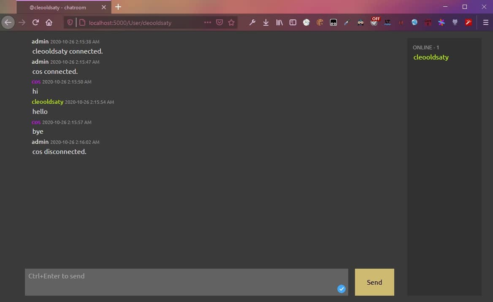

Following the example at https://docs.microsoft.com/en-ca/aspnet/core/tutorials/signalr-blazor-webassembly?view=aspnetcore-3.1.

Execute the following command in this folder to run the project:
```sh
$ dotnet run -p Server
```

Then go to `http://localhost:5000`.


